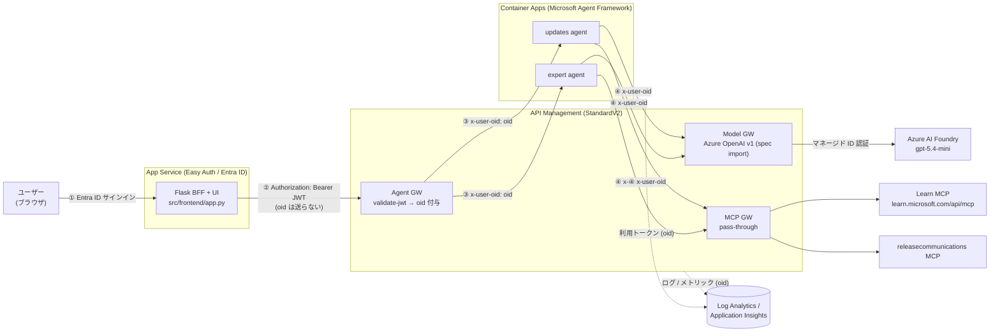
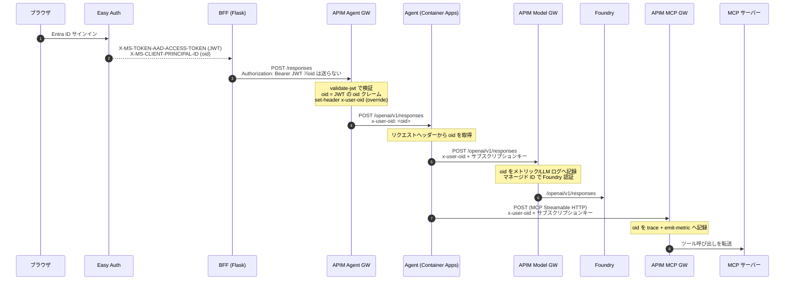

# デモガイド: Entra `oid` エンドツーエンド追跡 (AI Gateway)

認証済みユーザーの Entra **`oid`（オブジェクト ID）** を、3 つの論理 API Management ゲートウェイ（Agent GW / Model GW / MCP GW）を横断して伝搬・記録し、**oid 単位のログ検索**と **oid 単位のモデルトークン消費量（課金）**を実現する構成のデモ資料です。

---

## 1. 全体アーキテクチャ



| レイヤー | サービス | 役割 |
| --- | --- | --- |
| フロントエンド / BFF | App Service (Python/Flask, Easy Auth) | Entra 認証、ユーザートークンを Agent GW へ中継、SSE をブラウザへ中継 |
| ゲートウェイ | API Management StandardV2 | Agent GW（JWT 検証 + oid 付与）、Model GW（Azure OpenAI v1）、MCP GW（pass-through） |
| エージェント | Container Apps ×2（Agent Framework + FastAPI） | Responses API を公開、oid を全下流呼び出しへ伝搬 |
| モデル | Azure AI Foundry (`gpt-5.4-mini`) | Model GW からマネージド ID 認証で呼び出し |
| MCP サーバー | Learn MCP / releasecommunications MCP | MCP GW 経由で参照 |
| 可観測性 | Log Analytics + Application Insights | oid 付きログ・トークンメトリックを集約 |

---

## 2. `oid` の伝搬フロー

### 2.1 シーケンス



### 2.2 各ホップのヘッダーと APIM の役割

| ホップ | 送信元が付与するヘッダー | API Management の処理 | 下流へ渡るヘッダー |
| --- | --- | --- | --- |
| **BFF → Agent GW** | `Authorization: Bearer <JWT>`<br/>（**oid は付与しない**） | `validate-jwt` でトークンを検証し、`oid` クレームを抽出。`set-header` で `x-user-oid` を **生成（override）** | `x-user-oid: <oid>` |
| **Agent GW → Agent** | （APIM が付与） | — | `x-user-oid` |
| **Agent → Model GW** | `x-user-oid`<br/>`Ocp-Apim-Subscription-Key` | `x-user-oid` を `llm-emit-token-metric` の次元と LLM ログに記録。`set-backend-service` + マネージド ID で Foundry を認証 | `x-user-oid`（バックエンドへ） |
| **Agent → MCP GW** | `x-user-oid`<br/>`Ocp-Apim-Subscription-Key` | `x-user-oid` を `trace` と `emit-metric`（`mcp-calls`）に記録 | `x-user-oid`（バックエンドへ） |

> **要点:** BFF は `oid` を Agent へ直接渡しません（意図した仕様）。`oid` の確定は **API Management（Agent GW）が JWT を検証した後に行う**ため、クライアントが `oid` を詐称できません。`set-header ... exists-action="override"` により、仮にヘッダーが存在しても APIM が検証済みトークンの値で上書きします。

### 2.3 BFF のヘッダー処理コード（`src/frontend/app.py`）

BFF は Easy Auth が付与したユーザーの**アクセストークンのみ**を Agent GW へ中継します。`oid` は付与しません。

```python
def _access_token() -> str | None:
    # Easy Auth が注入したユーザーのアクセストークン
    return request.headers.get("X-MS-TOKEN-AAD-ACCESS-TOKEN")

# ... POST /api/chat 内 ...
token = _access_token()
if not token:
    return jsonify({"error": "not authenticated"}), 401

url = agent["base_url"].rstrip("/") + "/responses"
headers = {
    "Authorization": f"Bearer {token}",   # ← ユーザートークンのみを転送
    "Content-Type": "application/json",
    "Accept": "text/event-stream",
}
# x-user-oid は付与しない。oid の確定は Agent GW (APIM) が JWT 検証後に行う。
```

### 2.4 Agent GW ポリシー（`infra/policies/agent-gw.xml`）— APIM が oid を付与

```xml
<validate-jwt header-name="Authorization" require-scheme="Bearer"
              failed-validation-httpcode="401" output-token-variable-name="jwt">
  <openid-config url="__OPENID_CONFIG_URL__" />
  <audiences>
    <audience>__AUDIENCE_URI__</audience>
    <audience>__AUDIENCE_APPID__</audience>
  </audiences>
</validate-jwt>

<!-- 検証済みトークンの oid クレームから x-user-oid を生成（クライアント値があっても上書き） -->
<set-header name="x-user-oid" exists-action="override">
  <value>@(((Jwt)context.Variables["jwt"]).Claims.GetValueOrDefault("oid", "unknown"))</value>
</set-header>
```

### 2.5 Agent のヘッダー処理コード

**受信側 — APIM が付与した `x-user-oid` を読む（`src/agent/responses_app.py`）:**

```python
def _oid_from(request: Request) -> str:
    # Agent GW (APIM) が付与した x-user-oid を取得
    return request.headers.get(settings.oid_header_name, "anonymous")

@app.post("/openai/v1/responses")
async def create_response(request: Request):
    oid = _oid_from(request)
    turns = _normalize_input(await request.json())
    result = await run_once(oid, turns)   # oid を下流へ引き渡す
    ...
```

**送信側 — Model / MCP の全呼び出しに `x-user-oid` を付与（`src/agent/agent_runner.py`）:**

```python
def _model_headers(oid: str) -> dict[str, str]:
    return {
        "Ocp-Apim-Subscription-Key": settings.apim_subscription_key,
        settings.oid_header_name: oid,          # x-user-oid
    }

# ① モデル呼び出し: OpenAIChatClient の default_headers に付与
def _build_chat_client(oid: str) -> OpenAIChatClient:
    return OpenAIChatClient(
        base_url=settings.model_gw_base_url,    # https://<apim>/model/openai/v1
        api_key=settings.apim_subscription_key,
        model=settings.model_deployment_name,
        default_headers=_model_headers(oid),    # ← 毎リクエストに x-user-oid
    )

# ② MCP 呼び出し: リクエストスコープの HTTP クライアントに付与
#    （initialize / list / SSE / DELETE を含む全ての MCP 通信に oid を載せる）
async with AsyncClient(
    headers={
        "Ocp-Apim-Subscription-Key": settings.apim_subscription_key,
        settings.oid_header_name: oid,          # ← x-user-oid
    },
    follow_redirects=True,
    timeout=Timeout(30.0, read=300.0),
) as http_client:
    mcp_tool = MCPStreamableHTTPTool(url=settings.mcp_server_url, http_client=http_client)
```

### 2.6 Model GW / MCP GW ポリシー — oid を記録

**Model GW（`infra/policies/model-gw.xml`）:**

```xml
<set-backend-service backend-id="{backend-id}" />   <!-- マネージド ID 認証の Foundry バックエンド -->
<llm-emit-token-metric namespace="aigw">
  <dimension name="oid" value='@(context.Request.Headers.GetValueOrDefault("x-user-oid", "anonymous"))' />
  <dimension name="API ID" />
  <dimension name="gateway" value="model" />
</llm-emit-token-metric>
```

**MCP GW（`infra/policies/mcp-gw.xml`）:** MCP はストリーミング（Streamable HTTP）のためレスポンスボディは記録せず、oid とツール呼び出し回数を記録します。

```xml
<set-variable name="oid" value='@(context.Request.Headers.GetValueOrDefault("x-user-oid", "anonymous"))' />
<trace source="mcp-gw" severity="information">
  <message>@("MCP call for oid=" + (string)context.Variables["oid"])</message>
  <metadata name="oid" value='@((string)context.Variables["oid"])' />
</trace>
<emit-metric name="mcp-calls" value="1" namespace="aigw">
  <dimension name="oid" value='@((string)context.Variables["oid"])' />
  <dimension name="gateway" value="mcp" />
</emit-metric>
```

### 2.7 ログ上での oid の在り処（重要）

BFF は `oid` を送らず、**APIM が付与する**という設計のため、ホップごとに `oid` が記録される場所が異なります。

| ゲートウェイ | oid の付与者 | oid が記録されるテーブル | oid のキー |
| --- | --- | --- | --- |
| **Agent GW** | **API Management**（JWT 検証後にバックエンドへ付与） | `AppDependencies`（APIM → Agent への forward 呼び出し） | `Properties['Request-x-user-oid']` |
| **Model GW** | エージェント（受信時に既に付与済み） | `AppRequests`（APIM 受信） | `Properties['Request-x-user-oid']` |
| **MCP GW** | エージェント（受信時に既に付与済み） | `AppRequests`（APIM 受信） | `Properties['Request-x-user-oid']` |

> Agent GW の受信リクエスト（`AppRequests`）には `oid` が含まれません。BFF が送っていないからです。`oid` は APIM がバックエンド（エージェント）へ転送する際に付与するため、**`AppDependencies`（forward-request）側**に現れます。これがまさに「oid を付与しているのは APIM である」という事実を示します。

---

## 3. 課金用 KQL: oid 単位・モデル別の 1 時間トークン消費

ネイティブ LLM ログ（`ApiManagementGatewayLlmLog`）はモデル名（`DeploymentName`）とトークン数を保持します。oid は LLM ログの `CorrelationId` を、App Insights リクエストの APIM リクエスト ID（`Properties['Request Id']`）に突き合わせて付与します。

```kql
// 直近 1 時間、指定 oid のモデル別トークン消費量（モデル名を含む）
let targetOid = "<OID>";
let userReqs =
    AppRequests
    | where TimeGenerated > ago(1h)
    | extend oid   = tostring(Properties['Request-x-user-oid']),
             reqId = tostring(Properties['Request Id'])
    | where oid == targetOid and isnotempty(reqId)
    | distinct reqId, oid;
ApiManagementGatewayLlmLog
| where TimeGenerated > ago(1h)
| where TotalTokens > 0                       // APIM は prompt 行 + token 行を出すため使用量の行だけを対象化
| join kind=inner (userReqs) on $left.CorrelationId == $right.reqId
| summarize
    PromptTokens     = sum(PromptTokens),
    CompletionTokens = sum(CompletionTokens),
    TotalTokens      = sum(TotalTokens),
    Requests         = dcount(CorrelationId)
    by oid, Model = DeploymentName
| order by TotalTokens desc
```

出力例:

| oid | Model | PromptTokens | CompletionTokens | TotalTokens | Requests |
| --- | --- | --- | --- | --- | --- |
| `<OID>` | `gpt-5.4-mini` | 56 | 35 | 91 | 4 |

> **補足（低レイテンシの代替）:** `llm-emit-token-metric` が出力する `AppMetrics`（`Total Tokens`）は取り込みが速く oid 次元を持ちますが、**モデル名は含みません**（次元は `oid` / `gateway` / `API ID`）。モデル名が必要な課金用途では上記の `ApiManagementGatewayLlmLog` を使用します。
>
> ```kql
> // 参考: AppMetrics による oid 別合計（モデル名なし）
> AppMetrics
> | where TimeGenerated > ago(1h)
> | where Name == "Total Tokens"
> | extend oid = tostring(Properties['oid'])
> | where oid == "<OID>"
> | summarize TotalTokens = sum(Sum)
> ```

---

## 4. ペイロードログ用 KQL（oid 単位・直近 1 時間）

各ゲートウェイの入力／レスポンスペイロードは App Insights 診断（本文最大 8 KB）で取得します。前述のとおり **Agent GW は `AppDependencies`、Model / MCP GW は `AppRequests`** から取得します。

### 4.1 Agent（BFF → Agent GW → エージェント）

APIM がバックエンド（エージェント）へ転送する際に `oid` を付与するため、`AppDependencies` を参照します。入力＝BFF が送った Responses リクエスト、レスポンス＝エージェントの SSE 出力です。

```kql
let targetOid = "<OID>";
AppDependencies
| where TimeGenerated > ago(1h)
| where Target has "azurecontainerapps"          // Agent GW → エージェント（Container Apps）
| extend oid = tostring(Properties['Request-x-user-oid'])
| where oid == targetOid
| project TimeGenerated, oid, Name, Target,
          InputPayload    = tostring(Properties['Request-Body']),
          ResponsePayload = tostring(Properties['Response-Body']),   // SSE ストリーム
          ResultCode, DurationMs
| order by TimeGenerated desc
```

### 4.2 Model（エージェント → Model GW → Foundry）

エージェントが `x-user-oid` を送信するため、`AppRequests`（APIM 受信）を参照します。入力＝モデルリクエスト、レスポンス＝Foundry の応答（`usage` を含む）です。

```kql
let targetOid = "<OID>";
AppRequests
| where TimeGenerated > ago(1h)
| where Url has "/model/openai/"
| extend oid = tostring(Properties['Request-x-user-oid'])
| where oid == targetOid
| project TimeGenerated, oid,
          Operation       = tostring(Properties['Operation Name']),
          InputPayload    = tostring(Properties['Request-Body']),
          ResponsePayload = tostring(Properties['Response-Body']),
          ResultCode, DurationMs
| order by TimeGenerated desc
```

### 4.3 MCP（エージェント → MCP GW → MCP サーバー）

エージェントが `x-user-oid` を送信するため、`AppRequests` を参照します。入力＝JSON-RPC のツール呼び出し。**レスポンスボディはストリーミング（Streamable HTTP）のため記録しません**（本文バイト数 0 に設定）。

```kql
let targetOid = "<OID>";
AppRequests
| where TimeGenerated > ago(1h)
| where Url has "/mcp-"                            // mcp-learn / mcp-updates
| extend oid = tostring(Properties['Request-x-user-oid'])
| where oid == targetOid
| project TimeGenerated, oid,
          Server          = tostring(Properties['API Name']),
          Method          = tostring(Properties['HTTP Method']),
          InputPayload    = tostring(Properties['Request-Body']),   // 例: {"method":"tools/call","params":{...}}
          ResponsePayload = "（MCP はストリーミングのためレスポンスボディ非記録）",
          ResultCode
| order by TimeGenerated desc
```

> **ストリーミング時の注意:** Agent GW / Model GW をストリーミング（SSE）で呼び出した場合、レスポンス本文は SSE イベント列となり 8 KB で切り詰められることがあります。非ストリーミング呼び出しでは完全な JSON 本文が記録されます。トークン数の正確な集計は §3 の `ApiManagementGatewayLlmLog` を使用してください。

---

## 付録: oid の取得方法（デモ時）

- **実ユーザーの oid**: ブラウザで Entra ID サインイン後にチャットを実行すると、その署名済みユーザーの `oid`（GUID）で全ゲートウェイのログ・メトリックが記録されます。
- Agent GW を通ったリクエストの oid 一覧:

  ```kql
  AppDependencies
  | where TimeGenerated > ago(1h)
  | where Target has "azurecontainerapps"
  | extend oid = tostring(Properties['Request-x-user-oid'])
  | where isnotempty(oid)
  | summarize Requests = count() by oid
  ```
