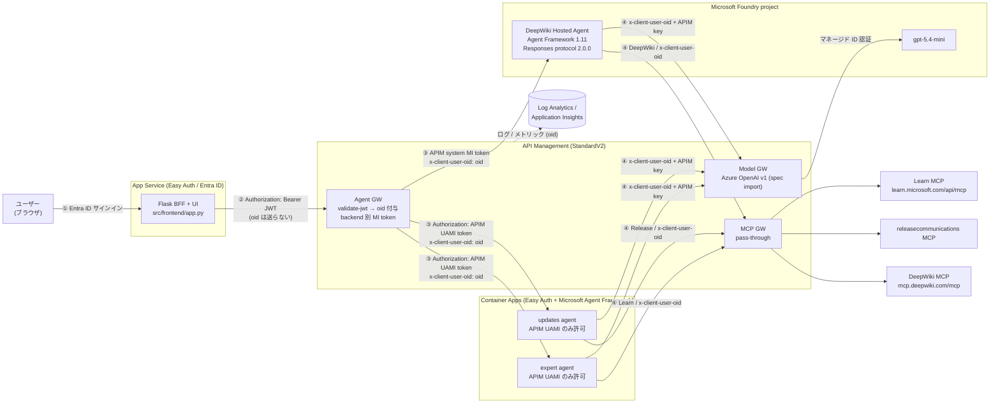
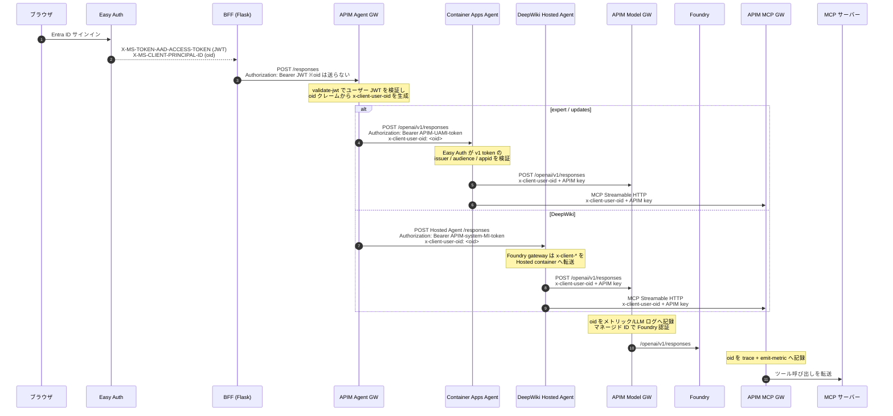

# デモガイド: Entra `oid` エンドツーエンド追跡 (AI Gateway)

認証済みユーザーの Entra **`oid`（オブジェクト ID）** を、3 つの論理 API Management ゲートウェイ（Agent GW / Model GW / MCP GW）を横断して伝搬・記録し、**oid 単位のログ検索**と **oid 単位のモデルトークン消費量（課金）**を実現する構成のデモ資料です。

---

## 1. 全体アーキテクチャ



| レイヤー | サービス | 役割 |
| --- | --- | --- |
| フロントエンド / BFF | App Service (Python/Flask, Easy Auth) | Entra 認証、ユーザートークンを Agent GW へ中継、SSE をブラウザへ中継 |
| ゲートウェイ | API Management StandardV2 | Agent GW（JWT 検証 + oid 付与）、Model GW（Azure OpenAI v1）、MCP GW（pass-through） |
| エージェント | Container Apps ×2（Easy Auth + Agent Framework `ResponsesHostServer`） | APIM MI のみ認証・認可、公式 Responses API server で oid を全下流呼び出しへ伝搬 |
| Hosted Agent | Microsoft Foundry Hosted Agent（Agent Framework 1.11） | Responses 2.0.0 を公開。`x-client-*` 転送規則で oid を受信し、DeepWiki MCP を利用 |
| モデル | Azure AI Foundry (`gpt-5.4-mini`) | Model GW からマネージド ID 認証で呼び出し |
| MCP サーバー | Learn / releasecommunications / DeepWiki MCP | 3 サーバーとも MCP GW 経由で参照。DeepWiki バックエンド自体は認証不要 |
| 可観測性 | Log Analytics + Application Insights | oid 付きログ・トークンメトリックを集約 |

### 1.1 エージェント一覧

| エージェント | ホスト | MAF server | MCP GW / backend | Agent GW → backend 認証 |
| --- | --- | --- | --- | --- |
| Azure expert | Container Apps | `ResponsesHostServer(prefix="/openai/v1")` | `mcp-learn` → Microsoft Learn MCP | 専用 APIM UAMI の v1 app-only token + Easy Auth |
| Azure updates | Container Apps | `ResponsesHostServer(prefix="/openai/v1")` | `mcp-updates` → Release communications MCP | 専用 APIM UAMI の v1 app-only token + Easy Auth |
| DeepWiki | Foundry Hosted Agent | `ResponsesHostServer` / protocol `2.0.0` | `mcp-deepwiki` → `https://mcp.deepwiki.com/mcp` | APIM system MI + Foundry Agent Consumer |

3 エージェントはすべて APIM Model GW 経由で `gpt-5.4-mini` を呼び出し、MCP 呼び出しも APIM MCP GW を経由します。DeepWiki backend 自体は匿名ですが、`mcp-deepwiki` API は他の MCP GW と同様に APIM subscription key を要求します。

---

## 2. `oid` の伝搬フロー

### 2.1 シーケンス



### 2.2 各ホップのヘッダーと APIM の役割

| ホップ | 送信元が付与するヘッダー | API Management の処理 | 下流へ渡るヘッダー |
| --- | --- | --- | --- |
| **BFF → Agent GW** | `Authorization: Bearer <JWT>`<br/>（**oid は付与しない**） | `validate-jwt` でトークンを検証し、`oid` クレームを抽出。`set-header` で `x-client-user-oid` を **生成（override）** | `x-client-user-oid: <oid>` |
| **Agent GW → Container Apps Agent** | （APIM が付与） | ユーザー JWT から `oid` を保存後、専用 UAMI で Agent backend audience のトークンを取得 | `Authorization: Bearer <APIM UAMI token>`<br/>`x-client-user-oid` |
| **Agent GW → Hosted Agent** | （APIM が付与） | APIM system identity で `https://ai.azure.com` のトークンを取得。Foundry Agent Consumer role で呼び出し | `Authorization: Bearer <APIM system MI token>`<br/>`x-client-user-oid` |
| **Agent → Model GW** | `x-client-user-oid`<br/>`Ocp-Apim-Subscription-Key` | `x-client-user-oid` を `llm-emit-token-metric` の次元と LLM ログに記録。`set-backend-service` + マネージド ID で Foundry を認証 | `x-client-user-oid`（バックエンドへ） |
| **Agent → MCP GW** | `x-client-user-oid`<br/>`Ocp-Apim-Subscription-Key` | `x-client-user-oid` を `trace` と `emit-metric`（`mcp-calls`）に記録 | `x-client-user-oid`（バックエンドへ） |

> **要点:** BFF は `oid` を Agent へ直接渡しません（意図した仕様）。`oid` の確定は **API Management（Agent GW）が JWT を検証した後に行う**ため、クライアントが `oid` を詐称できません。`set-header ... exists-action="override"` により、仮にヘッダーが存在しても APIM が検証済みトークンの値で上書きします。

> **Agent backend の認証境界:** backend app は app-role assignment を必須とし、`Agent.Invoke` role は APIM 専用 User Assigned Managed Identity だけに割り当てます。Container Apps Easy Auth は v1 Bearer token の署名・issuer・audience を検証し、`allowedApplications` で UAMI の `appid` だけを許可します。未割り当て identity には Entra がトークンを発行せず、無効な呼び出しは MAF server 到達前に拒否されます。

> **Hosted Agent の認証境界:** APIM system identity に Foundry project scope の **Foundry Agent Consumer** のみを付与し、Agent GW が audience `https://ai.azure.com` の token を取得します。Container Apps 用の専用 UAMI / Agent backend app role は Hosted Agent 呼び出しには使いません。

> **Hosted Agent の転送規則:** Foundry Hosted Agent gateway は任意のカスタムヘッダーをコンテナーへ渡しませんが、`x-client-` で始まるヘッダーは変更せず転送します。このため全 Agent / Model / MCP 経路を `x-client-user-oid` に統一しています。Hosted Agent は Responses protocol `2.0.0` を使用します。Foundry `x-ms-user-identity` 委譲はこの構成では有効化していません。

### 2.3 BFF のヘッダー処理コード（`src/frontend/app.py`）

BFF は Easy Auth が付与したユーザーの**アクセストークンのみ**を Agent GW へ中継します。`oid` は付与しません。

```python
def _access_token() -> str | None:
    # Easy Auth が注入したユーザーのアクセストークン
    return request.headers.get("X-MS-TOKEN-AAD-ACCESS-TOKEN")

# ... POST /api/chat 内 ...
token = _access_token()
if not token:
    return jsonify({"error": "not authenticated"}), 401

url = agent["base_url"].rstrip("/") + "/responses"
headers = {
    "Authorization": f"Bearer {token}",   # ← ユーザートークンのみを転送
    "Content-Type": "application/json",
    "Accept": "text/event-stream",
}
# x-client-user-oid は付与しない。oid の確定は Agent GW (APIM) が JWT 検証後に行う。
```

### 2.4 Agent GW ポリシー（`infra/policies/agent-gw.xml`）— APIM が oid を付与

Container Apps Agent 用ポリシーは、検証済み user token から oid を保存した後、専用 APIM UAMI の backend token へ `Authorization` を置換します。

```xml
<validate-jwt header-name="Authorization" require-scheme="Bearer"
              failed-validation-httpcode="401" output-token-variable-name="jwt">
  <openid-config url="__OPENID_CONFIG_URL__" />
  <audiences>
    <audience>__AUDIENCE_URI__</audience>
    <audience>__AUDIENCE_APPID__</audience>
  </audiences>
</validate-jwt>

<!-- 検証済みトークンの oid クレームから x-client-user-oid を生成（クライアント値があっても上書き） -->
<set-header name="x-client-user-oid" exists-action="override">
  <value>@(((Jwt)context.Variables["jwt"]).Claims.GetValueOrDefault("oid", "unknown"))</value>
</set-header>

<!-- ユーザー JWT を APIM Managed Identity の Agent backend token に置換 -->
<authentication-managed-identity
    resource="__AGENT_BACKEND_AUDIENCE__"
    client-id="__AGENT_BACKEND_CALLER_CLIENT_ID__"
    ignore-error="false" />
```

DeepWiki 用 `infra/policies/agent-hosted-gw.xml` は同じ JWT / oid 処理に加え、Foundry preview header、Responses path rewrite、APIM system MI 認証を行います。

```xml
<set-header name="x-client-user-oid" exists-action="override">
    <value>@(((Jwt)context.Variables["jwt"]).Claims.GetValueOrDefault("oid", "unknown"))</value>
</set-header>
<set-header name="Foundry-Features" exists-action="override">
    <value>HostedAgents=V1Preview</value>
</set-header>
<set-query-parameter name="api-version" exists-action="override">
    <value>v1</value>
</set-query-parameter>
<rewrite-uri template="/responses" />
<authentication-managed-identity resource="https://ai.azure.com" ignore-error="false" />
```

### 2.5 Container Apps Agent — MAF server とヘッダー処理

Container Apps Agent も `ResponsesHostServer` を使用します。`prefix="/openai/v1"` により既存の Agent GW contract を維持しつつ、入力変換、Responses envelope、SSE lifecycle、history、cancel/error、`/readiness`、OpenTelemetry を MAF に委譲します。旧 FastAPI server、独自 envelope/SSE生成、usage集計は削除済みです。独自処理は oid の request scope と下流 client の生成だけです（`src/agent/main.py`）。

現在の preview hosting adapter は MAF の `usage` content を外側の Agent response へ投影しないため、トークン利用量は Model GW のネイティブ LLM ログを正とします。

```python
class OidAwareResponsesHostServer(ResponsesHostServer):
    async def _handle_response(self, request, context, cancellation_signal):
        token = _current_oid.set(
            context.client_headers.get("x-client-user-oid", "anonymous")
        )
        try:
            events = await super()._handle_response(request, context, cancellation_signal)
            async for event in events:
                yield event
        finally:
            _current_oid.reset(token)

# RequestScopedAgent creates both official MAF clients with the same trusted oid.
headers = {
    "Ocp-Apim-Subscription-Key": APIM_SUBSCRIPTION_KEY,
    "x-client-user-oid": _current_oid.get(),
}
chat_client = OpenAIChatClient(default_headers=headers, ...)
http_client = AsyncClient(headers=headers, ...)
mcp_tool = MCPStreamableHTTPTool(http_client=http_client, ...)

server = OidAwareResponsesHostServer(RequestScopedAgent(), prefix="/openai/v1")
server.run()  # PORT env var is resolved by AgentServerHost
```

### 2.6 Hosted DeepWiki Agent のヘッダー処理コード

Hosted Agent protocol library は、Foundry gateway が転送した `x-client-*` ヘッダーを `ResponseContext.client_headers` に公開します。レスポンスストリームの全ライフサイクルで oid を保持し、リクエストスコープの Agent Framework client を構築します。

```python
_current_oid: ContextVar[str] = ContextVar("deepwiki_current_oid", default="anonymous")

class OidAwareResponsesHostServer(ResponsesHostServer):
    async def _handle_response(self, request, context, cancellation_signal):
        token = _current_oid.set(
            context.client_headers.get("x-client-user-oid", "anonymous")
        )
        try:
            response_events = await super()._handle_response(
                request, context, cancellation_signal
            )
            async for event in response_events:
                yield event
        finally:
            _current_oid.reset(token)

server = OidAwareResponsesHostServer(RequestScopedDeepWikiAgent())

# RequestScopedDeepWikiAgent はリクエストごとに同じ headers を両方へ設定する。
headers = {
    "Ocp-Apim-Subscription-Key": APIM_SUBSCRIPTION_KEY,
    "x-client-user-oid": _current_oid.get(),
}
chat_client = OpenAIChatClient(default_headers=headers, ...)
http_client = AsyncClient(headers=headers, ...)
mcp_tool = DeepWikiMCPStreamableHTTPTool(
    url=MCP_SERVER_URL,
    http_client=http_client,
)
```

DeepWiki MCP の公開 URL は `https://mcp.deepwiki.com/mcp` で、バックエンド認証は不要です。ただし Hosted Agent は APIM MCP GW のサブスクリプション保護を通るため、上記 APIM key を送信します。key はソースや `azure.yaml` に保存せず、デプロイ前 hook が Foundry の `CustomKeys` connection に格納します。

DeepWiki は現在、ツール一覧に空の非標準メタデータ `_meta._fastmcp` を付与します。Agent Framework 1.11 は MCP 仕様に従ってこのキーを拒否するため、`DeepWikiMCPStreamableHTTPTool` は session を委譲しつつ、`tools/list` のうち MCP 2025-06-18 の key-name grammar に違反するメタデータだけを除外します。ツールの自動 discovery、tool call、retry、telemetry、結果変換は引き続き Agent Framework が処理します。

### 2.7 APIM subscription key の安全な配布

Agent → Model/MCP GW は `Ocp-Apim-Subscription-Key` と `x-client-user-oid` の両方を送信します。前者は APIM subscription 認証、後者はユーザー別の可観測性に使用します。

| 実行環境 | key の保管・注入方法 |
| --- | --- |
| Container Apps agents | Bicep が APIM `agents` subscription の secret を Container Apps secret として設定し、`APIM_SUBSCRIPTION_KEY` へ secret reference で注入 |
| Foundry Hosted Agent | `predeploy` hook が write-only Foundry `CustomKeys` connection `apim-agent-subscription` の `api_key` に保存し、`${{connections.apim-agent-subscription.credentials.api_key}}` で runtime 注入 |

key の実値は source、Bicep、`azure.yaml` に保存しません。Foundry connection の GET も credential を返しません。

### 2.8 Model GW / MCP GW ポリシー — oid を記録

**Model GW（`infra/policies/model-gw.xml`）:**

```xml
<set-backend-service backend-id="{backend-id}" />   <!-- マネージド ID 認証の Foundry バックエンド -->
<llm-emit-token-metric namespace="aigw">
    <dimension name="oid" value='@(context.Request.Headers.GetValueOrDefault("x-client-user-oid", "anonymous"))' />
  <dimension name="API ID" />
  <dimension name="gateway" value="model" />
</llm-emit-token-metric>
```

**MCP GW（`infra/policies/mcp-gw.xml`）:** MCP はストリーミング（Streamable HTTP）のためレスポンスボディは記録せず、oid とツール呼び出し回数を記録します。

```xml
<set-variable name="oid" value='@(context.Request.Headers.GetValueOrDefault("x-client-user-oid", "anonymous"))' />
<trace source="mcp-gw" severity="information">
  <message>@("MCP call for oid=" + (string)context.Variables["oid"])</message>
  <metadata name="oid" value='@((string)context.Variables["oid"])' />
</trace>
<emit-metric name="mcp-calls" value="1" namespace="aigw">
  <dimension name="oid" value='@((string)context.Variables["oid"])' />
  <dimension name="gateway" value="mcp" />
</emit-metric>
```

### 2.9 ログ上での oid の在り処（重要）

BFF は `oid` を送らず、**APIM が付与する**という設計のため、ホップごとに `oid` が記録される場所が異なります。

| ゲートウェイ / hop | oid の状態 | oid が記録されるテーブル | oid のキー |
| --- | --- | --- | --- |
| **BFF → Agent GW inbound** | 未付与（BFF は user token のみ送信） | `AppRequests` | trusted oid は存在しない |
| **Agent GW → Agent backend** | APIM が JWT 検証後に上書き付与 | `AppDependencies` | `Properties['Request-x-client-user-oid']` |
| **Model GW** | エージェント（受信時に既に付与済み） | `AppRequests`（APIM 受信） | `Properties['Request-x-client-user-oid']` |
| **MCP GW** | エージェント（受信時に既に付与済み） | `AppRequests`（APIM 受信） | `Properties['Request-x-client-user-oid']` |

> Agent GW の受信リクエスト（`AppRequests`）には `oid` が含まれません。BFF が送っていないからです。`oid` は APIM がバックエンド（エージェント）へ転送する際に付与するため、**`AppDependencies`（forward-request）側**に現れます。これがまさに「oid を付与しているのは APIM である」という事実を示します。

---

## 3. 課金用 KQL: oid 単位・モデル別の 1 時間トークン消費

ネイティブ LLM ログ（`ApiManagementGatewayLlmLog`）はモデル名（`DeploymentName`）とトークン数を保持します。oid は LLM ログの `CorrelationId` を、App Insights リクエストの APIM リクエスト ID（`Properties['Request Id']`）に突き合わせて付与します。

```kql
// 直近 1 時間、指定 oid のモデル別トークン消費量（モデル名を含む）
let targetOid = "<OID>";
let userReqs =
    AppRequests
    | where TimeGenerated > ago(1h)
    | extend oid   = tostring(Properties['Request-x-client-user-oid']),
             reqId = tostring(Properties['Request Id'])
    | where oid == targetOid and isnotempty(reqId)
    | distinct reqId, oid;
ApiManagementGatewayLlmLog
| where TimeGenerated > ago(1h)
| where TotalTokens > 0                       // APIM は prompt 行 + token 行を出すため使用量の行だけを対象化
| join kind=inner (userReqs) on $left.CorrelationId == $right.reqId
| summarize
    PromptTokens     = sum(PromptTokens),
    CompletionTokens = sum(CompletionTokens),
    TotalTokens      = sum(TotalTokens),
    Requests         = dcount(CorrelationId)
    by oid, Model = DeploymentName
| order by TotalTokens desc
```

出力例:

| oid | Model | PromptTokens | CompletionTokens | TotalTokens | Requests |
| --- | --- | --- | --- | --- | --- |
| `<OID>` | `gpt-5.4-mini` | 56 | 35 | 91 | 4 |

> **補足（低レイテンシの代替）:** `llm-emit-token-metric` が出力する `AppMetrics`（`Total Tokens`）は取り込みが速く oid 次元を持ちますが、**モデル名は含みません**（次元は `oid` / `gateway` / `API ID`）。モデル名が必要な課金用途では上記の `ApiManagementGatewayLlmLog` を使用します。
>
> ```kql
> // 参考: AppMetrics による oid 別合計（モデル名なし）
> AppMetrics
> | where TimeGenerated > ago(1h)
> | where Name == "Total Tokens"
> | extend oid = tostring(Properties['oid'])
> | where oid == "<OID>"
> | summarize TotalTokens = sum(Sum)
> ```

---

## 4. ペイロードログ用 KQL（oid 単位・直近 1 時間）

各ゲートウェイの入力／レスポンスペイロードは App Insights 診断（本文最大 8 KB）で取得します。前述のとおり **Agent GW は `AppDependencies`、Model / MCP GW は `AppRequests`** から取得します。

### 4.1 Agent（BFF → Agent GW → エージェント）

APIM がバックエンド（エージェント）へ転送する際に `oid` を付与するため、`AppDependencies` を参照します。入力＝BFF が送った Responses リクエスト、レスポンス＝エージェントの SSE 出力です。

```kql
let targetOid = "<OID>";
AppDependencies
| where TimeGenerated > ago(1h)
| where Target has "azurecontainerapps"            // Container Apps agents
    or Target has ".services.ai.azure.com"          // Foundry Hosted Agent
| extend oid = tostring(Properties['Request-x-client-user-oid'])
| where oid == targetOid
| project TimeGenerated, oid, Name, Target,
          InputPayload    = tostring(Properties['Request-Body']),
          ResponsePayload = tostring(Properties['Response-Body']),   // SSE ストリーム
          ResultCode, DurationMs
| order by TimeGenerated desc
```

### 4.2 Model（エージェント → Model GW → Foundry）

エージェントが `x-client-user-oid` を送信するため、`AppRequests`（APIM 受信）を参照します。入力＝モデルリクエスト、レスポンス＝Foundry の応答（`usage` を含む）です。

```kql
let targetOid = "<OID>";
AppRequests
| where TimeGenerated > ago(1h)
| where Url has "/model/openai/"
| extend oid = tostring(Properties['Request-x-client-user-oid'])
| where oid == targetOid
| project TimeGenerated, oid,
          Operation       = tostring(Properties['Operation Name']),
          InputPayload    = tostring(Properties['Request-Body']),
          ResponsePayload = tostring(Properties['Response-Body']),
          ResultCode, DurationMs
| order by TimeGenerated desc
```

### 4.3 MCP（エージェント → MCP GW → MCP サーバー）

エージェントが `x-client-user-oid` を送信するため、`AppRequests` を参照します。入力＝JSON-RPC のツール呼び出し。**レスポンスボディはストリーミング（Streamable HTTP）のため記録しません**（本文バイト数 0 に設定）。

```kql
let targetOid = "<OID>";
AppRequests
| where TimeGenerated > ago(1h)
| where Url has "/mcp-"                            // mcp-learn / mcp-updates / mcp-deepwiki
| extend oid = tostring(Properties['Request-x-client-user-oid'])
| where oid == targetOid
| project TimeGenerated, oid,
          Server          = tostring(Properties['API Name']),
          Method          = tostring(Properties['HTTP Method']),
          InputPayload    = tostring(Properties['Request-Body']),   // 例: {"method":"tools/call","params":{...}}
          ResponsePayload = "（MCP はストリーミングのためレスポンスボディ非記録）",
          ResultCode
| order by TimeGenerated desc
```

> **ストリーミング時の注意:** Agent GW / Model GW をストリーミング（SSE）で呼び出した場合、レスポンス本文は SSE イベント列となり 8 KB で切り詰められることがあります。非ストリーミング呼び出しでは完全な JSON 本文が記録されます。トークン数の正確な集計は §3 の `ApiManagementGatewayLlmLog` を使用してください。

---

## 5. デプロイフロー

`azd up` で以下を一括実行します。

1. Foundry account / project / model、APIM、Container Apps、App Service、監視を Bicep でプロビジョニング
2. APIM system identity と専用 Agent backend UAMI、Entra Agent backend app / `Agent.Invoke` role、Foundry RBAC を構成
3. `postprovision` hook で App Service Easy Auth secret と admin consent を構成
4. `predeploy` hook で Hosted Agent 用 APIM key を Foundry `CustomKeys` connection へ格納
5. Expert / Updates の共有 source imageを各 Container Appへデプロイ
6. DeepWiki sourceを Foundry Hosted Agentとしてデプロイ
7. Flask BFF / UIをApp Serviceへデプロイ

主要 output は `AGENT_GW_EXPERT_URL`、`AGENT_GW_UPDATES_URL`、`AGENT_GW_DEEPWIKI_URL`、`MCP_GW_*`、`FOUNDRY_PROJECT_ENDPOINT`、`AZURE_AI_PROJECT_ID` です。

---

## 6. セキュリティ・回帰確認

デプロイ後は次を確認します。

| 確認 | 期待値 |
| --- | --- |
| Agent GW を token なしで呼び出す | `401` |
| Container Apps Agent / `/readiness` を直接匿名呼び出し | Easy Auth が `401` |
| Hosted Agentを直接 token なしで呼び出す | `401` |
| Expert / UpdatesをAgent GW経由で呼び出す | `200`; MAF `response` / SSE lifecycle |
| DeepWikiをAgent GW経由で呼び出す | `200`; `read_wiki_structure` 等のtool call |
| Model/MCP GW telemetry | 同じ `x-client-user-oid`、成功 result code |
| `ApiManagementGatewayLlmLog` | oid・`gpt-5.4-mini`・Prompt/Completion/Total tokenをjoin可能 |

MAF runtimeの起動は Container Apps console log の `Responses protocol`、`AgentServerHost starting`、`AgentServerHost started` で確認できます。詳細な検索は `docs/queries.kql` を使用します。

---

## 付録: oid の取得方法（デモ時）

- **実ユーザーの oid**: ブラウザで Entra ID サインイン後にチャットを実行すると、その署名済みユーザーの `oid`（GUID）で全ゲートウェイのログ・メトリックが記録されます。
- Agent GW を通ったリクエストの oid 一覧:

  ```kql
  AppDependencies
  | where TimeGenerated > ago(1h)
    | where Target has "azurecontainerapps"
            or Target has ".services.ai.azure.com"
    | extend oid = tostring(Properties['Request-x-client-user-oid'])
  | where isnotempty(oid)
  | summarize Requests = count() by oid
  ```
